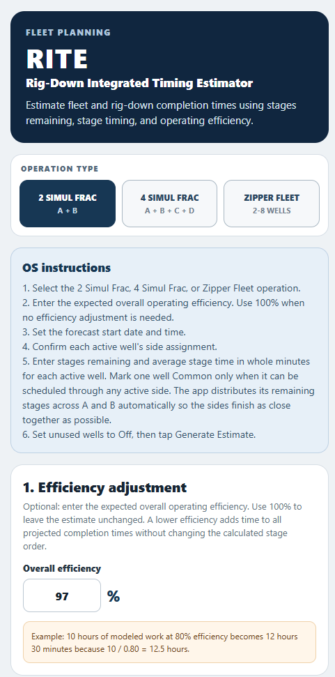
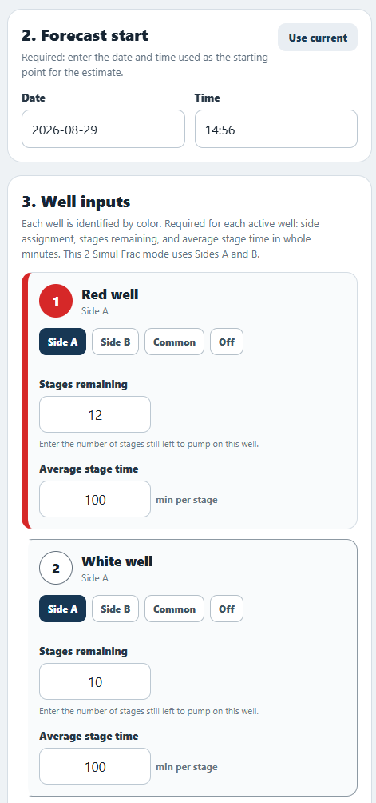
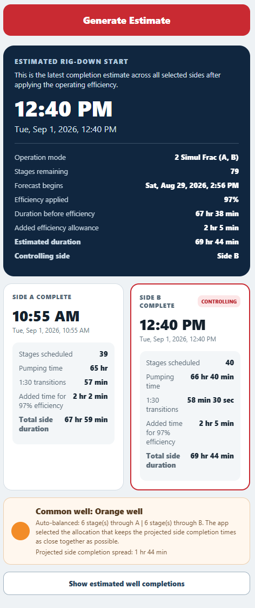
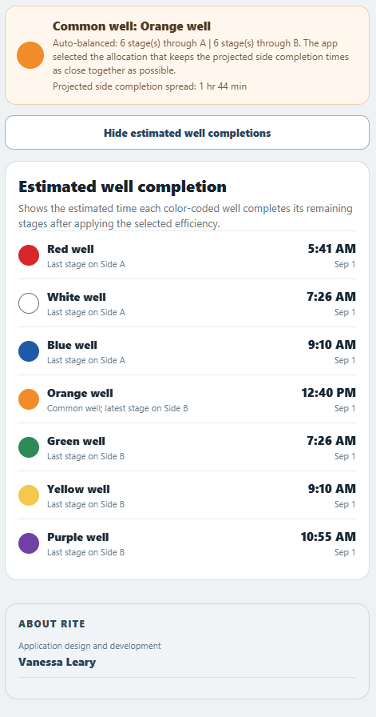

# RITE — Rig-Down Integrated Timing Estimator

RITE is a field-planning application I designed and developed during a Summer 2026 upstream completions operations internship.

The application estimates when remaining completion work will finish and when rig-down activities can begin. It models stages remaining, average stage duration, transition time, operating efficiency, concurrent workstreams, and common-well allocation.

> **Portfolio notice:** This repository documents a sanitized portfolio version of the project. It is not connected to the live operational deployment and does not contain company data, production URLs, credentials, QR codes, or private operational records.

## The Operational Problem

Completion personnel needed a consistent way to estimate the remaining time before rig-down could begin.

Manual calculations could become difficult when operations included:

- Multiple wells with different stages remaining
- Simultaneous A-side and B-side work
- Four-side simul-frac configurations
- Zipper-frac sequencing
- Different average stage durations
- Common wells shared between operational sides
- Changes in expected operating efficiency
- A 90-second transition between stages

RITE brings those inputs into one repeatable timing model.

## Core Capabilities

- Supports 2 Simul Frac, 4 Simul Frac, and Zipper Fleet operations
- Models up to eight color-coded wells
- Uses stages remaining and average stage time for each active well
- Applies an overall operating-efficiency adjustment
- Estimates completion time for each operational side
- Identifies the controlling operational side
- Estimates the projected rig-down start time
- Automatically distributes common-well stages to reduce the completion-time spread
- Shows estimated completion time for each color-coded well
- Saves user inputs locally for continuity between sessions
- Validates incomplete or invalid user inputs before calculating an estimate

## Calculation Approach

RITE builds a remaining-stage schedule for each active operational side.

For simul-frac operations, sides are modeled concurrently. The latest projected side completion controls the estimated rig-down start.

When a common well is included, the application evaluates possible allocations of its remaining stages and selects the allocation that:

1. Minimizes the completion-time spread between sides
2. Minimizes the controlling completion time
3. Reduces overall deviation between side completion times
4. Produces a balanced and repeatable allocation

The modeled duration is then adjusted using the selected operating-efficiency percentage.

## My Contribution

I:

- Identified the field-planning problem and user requirements
- Defined the required well, stage, timing, and efficiency inputs
- Designed the color-coded user workflow
- Developed the application logic and user interface
- Created the common-well balancing method
- Added input validation and local state persistence
- Tested estimates against field calculations
- Created a QR-accessible web deployment for operational use
- Incorporated feedback from completions personnel

## Technologies Used

- JavaScript
- Expo Snack
- React Native components
- Expo Application Services
- AsyncStorage
- Web-based responsive user interface
- Scheduling and optimization logic

## Application Screenshots

### Operation Modes

### Well Inputs

### Estimated Rig-Down Timing

### Estimated Well Completions

## Outcome

A web-accessible version of RITE was adopted for operational use by at least three completion fleets.

The application provided a repeatable method for forecasting remaining completion time, identifying the controlling workstream, and improving communication around projected rig-down readiness.

## Repository Scope

This repository is intended to demonstrate the project's purpose, design, workflow, and technical approach.

The operational deployment, employer-specific information, real field data, production QR code, and production hosting configuration are intentionally excluded.
